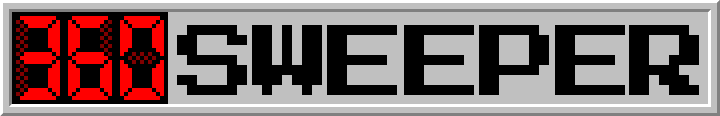
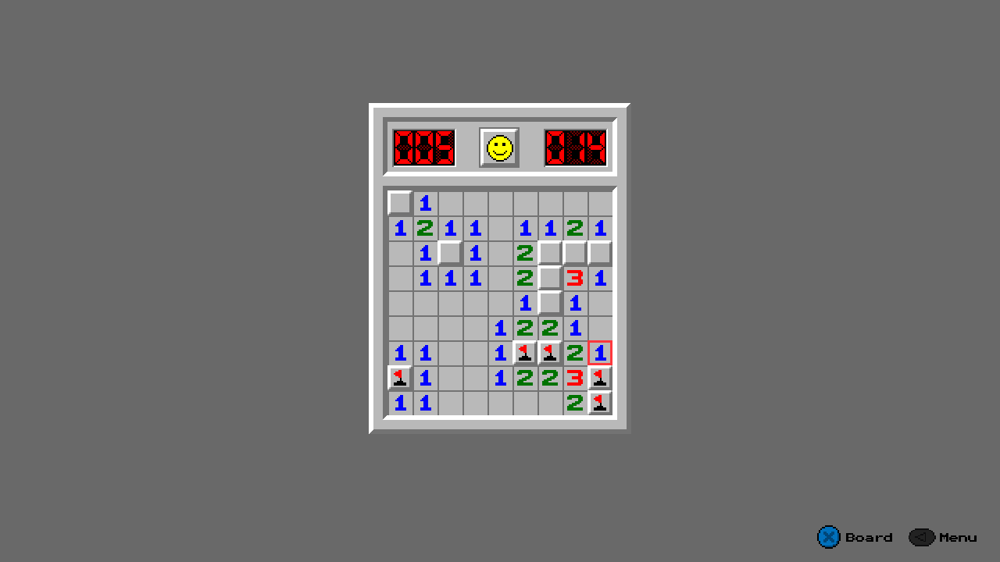
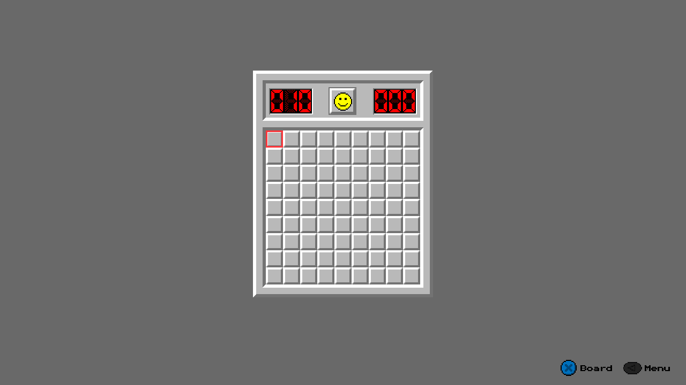
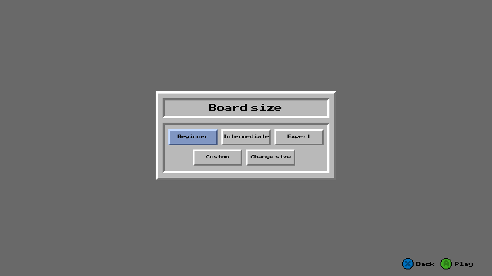
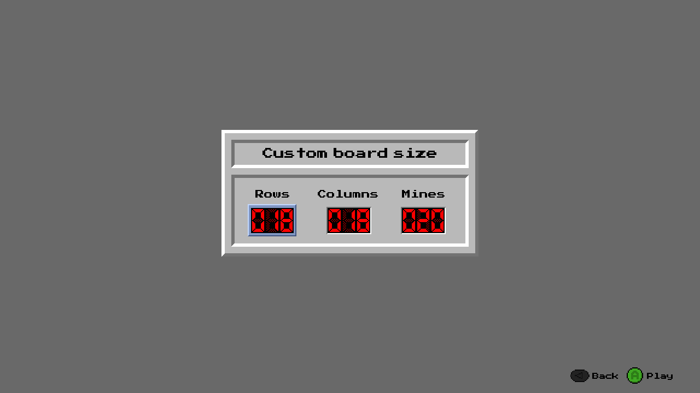
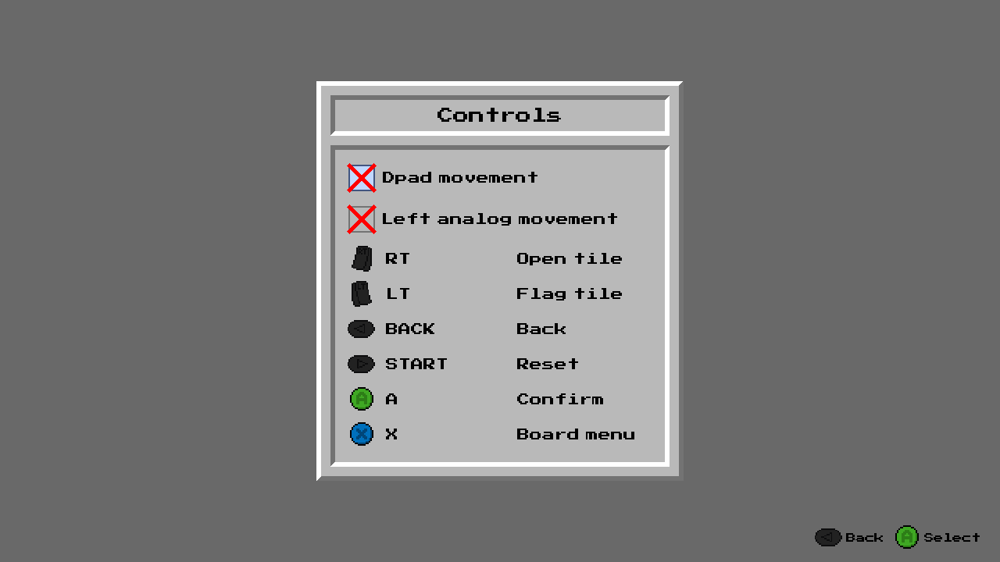
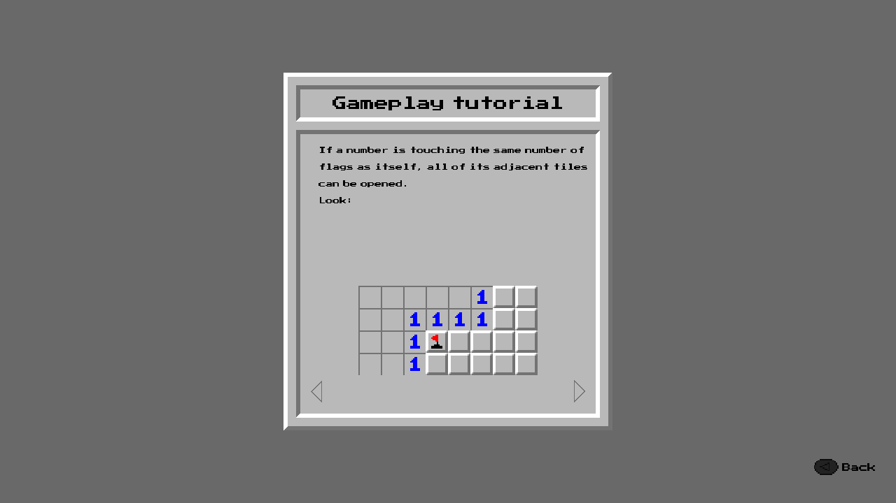
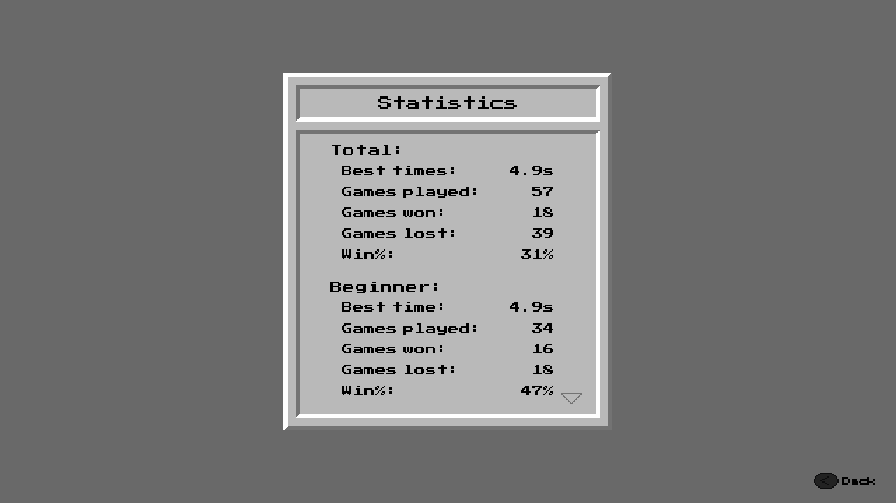

  

A Minesweeper port for the Xbox 360, written in C++.

| | |
|---|---|
|  |  |
| *During game* | *A fresh board ready to play* |
|  |  |
| *Choosing a board size* | *Setting up a custom board* |
|  |  |
| *The controls screen with remappable buttons* | *The built-in Minesweeper tutorial* |
|  | |
| *Per-mode and total statistics* | |

---

## Features

- **Standard board sizes** — Beginner, Intermediate, Expert, and Custom with adjustable dimensions
- **Statistics** — tracks times, wins, win %, and games played per game mode and as totals
- **Changeable controls** — remap every action to your preferred button (see defaults below)
- **Settings** — volume, vibration strength, move cooldown, and more — [Settings Reference](SETTINGS.md)
- **Texture pack support** — reskin the entire game — [Texture Pack Reference](TEXTURE_PACKS.md)
- **Built-in tutorial** — learn how to play Minesweeper straight from the game
- **Vibration feedback** — your controller rumbles when you hit a mine

### Default controls

| Action | Button |
|---|---|
| Back | BACK |
| Reset | START |
| Confirm | A |
| Board menu | X |
| Open tile | RT |
| Flag tile | LT |

---

## Requirements

- A modded Xbox 360 (BadUpdate, BadAvatar, RGH, etc.)

---

## Installation

1. Download **360sweeper.zip** from the [latest release](../../releases/latest)
2. Extract the zip

Copy the 65656565 folder and put it in hdd:\Content\0000000000000000\
Usb works too.
The game will be visible in the stock dashboard as a demo.
If you want to launch the game thru aurora or other custom dash make sure \Content\0000000000000000\ with depth 2 is a content directory for games.

## Building from Source

1. Install **Visual Studio 2010 Ultimate**
2. Install the **Xbox 360 SDK** — make sure to select **Full Install** — VS 2010 Ultimate must be installed **BEFORE** for that option
3. Download the source files from the [`src`](src/) folder
4. Open `360sweeper.sln` in Visual Studio 2010 **as Administrator**
5. Set the configuration to **Release**
6. Build the solution
7. Copy the **Content** folder next to the output `.xex` — grab from  [`texture packs`](Texture packs/)

---
## Contributing

You can submit a texture pack that follows the documentation in [Texture Pack Reference](TEXTURE_PACKS.md)

---
## Legal
 
360sweeper is a non-commercial fan project made for fun and preservation purposes. It is not affiliated with, endorsed by, or associated with Microsoft Corporation in any way.
 
Xbox and Xbox 360 are trademarks of Microsoft Corporation. Minesweeper is a trademark of Microsoft Corporation. All trademarks are the property of their respective owners.

## Links

- [Texture Pack Reference](TEXTURE_PACKS.md)
- [Credits](CREDITS.md)
- [Settings Reference](SETTINGS.md)

## Contact 
Any questions or issues? Contact me.

Discord: 
rutinoscorbin
