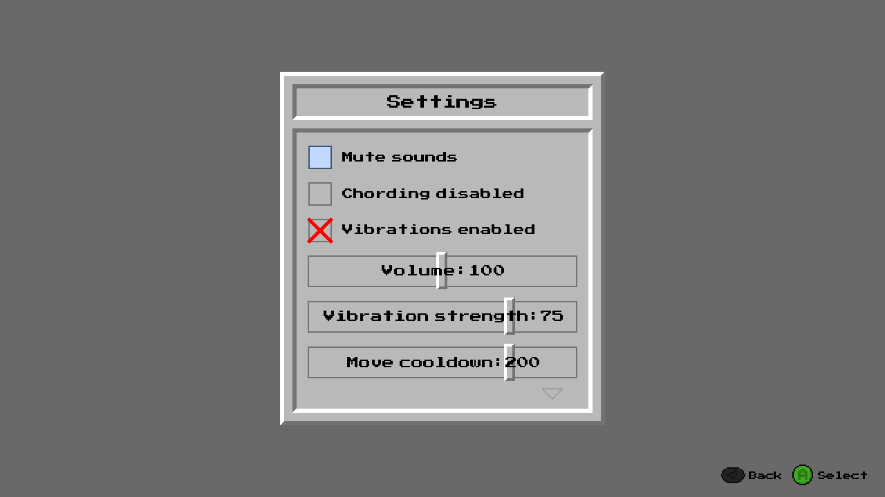
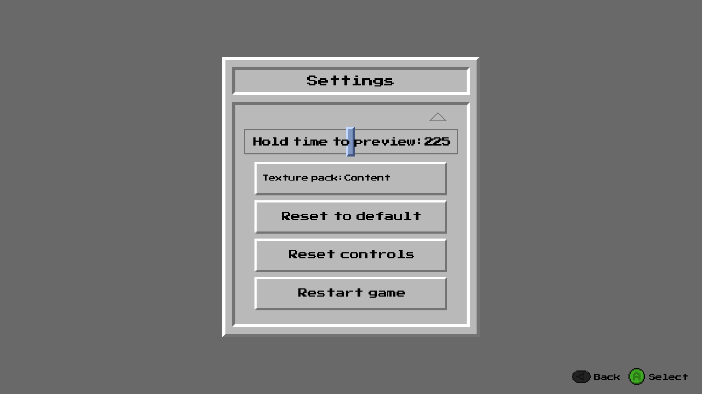

# 360sweeper — Settings Reference

---

## Page 1

**Mute sounds** — When enabled, silences all in-game audio.

**Chording disabled** — When enabled, turns off chording. Chording is the ability to instantly reveal all cells around a numbered tile when the number of flags placed around it matches that tile's number. Disable this if you want to open every cell manually.

**Vibrations enabled** — When enabled, your gamepad will vibrate when you hit a mine.

**Volume** — Controls the playback volume of in-game sounds.

**Vibration strength** — Sets how hard the gamepad motors vibrate when triggered, as a percentage of their maximum power.

**Move cooldown** — The minimum time (in milliseconds) you must wait between moving from one tile to another, or from one UI element to another. Increase this if cursor movement feels too fast, lower if too slow.

---

## Page 2

**Hold time to preview** — How long (in milliseconds) you need to hold down on a tile before all of its adjacent cells that arent flagged temporarily change texture for the duration of the hold, giving you a visual hint about what's around it.

**Texture pack** — Selects which texture pack the game uses. Press **left/right** to cycle through available packs, then press **A** to apply, wait a second and it will load.

**Reset to default** — Resets all settings back to their default values.

**Reset controls** — Resets all controls back to their default values.

**Restart game** — Restarts the game.

